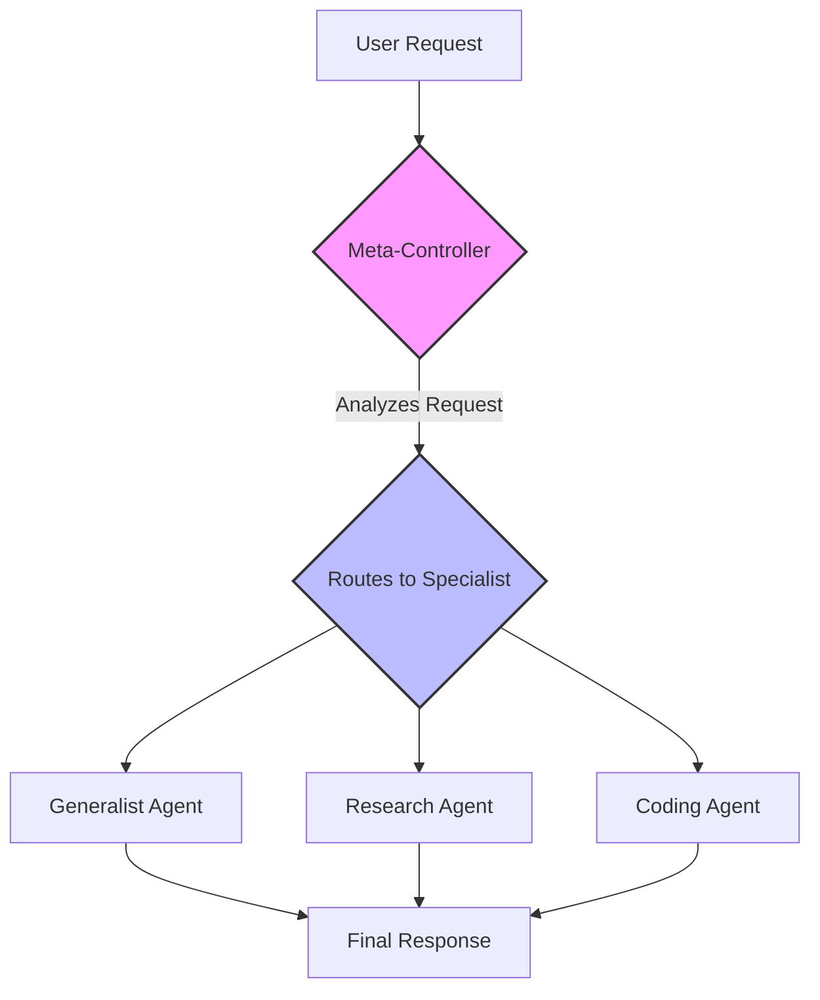

# 全部智能体架构（中文初版）

本仓库是基于 [FareedKhan-dev/all-agentic-architectures](https://github.com/FareedKhan-dev/all-agentic-architectures) 的中文初版，感谢原作者 Fareed Khan 的贡献。

     [](https://opensource.org/licenses/MIT)

欢迎来到一门关于**现代 AI 智能体（agent）设计**的系统化、动手实践的课程。本仓库包含 **17+ 种前沿智能体架构** 的详细实现，基于 LangChain 与 LangGraph 构建。它被设计成一本“活的教科书”，将理论概念与可运行、可复用的工程代码连接起来。

## 为何选择这个仓库？

- **从理论到可运行代码：** 每一种架构不仅有解释，还有端到端、可运行的 Jupyter Notebook。
- **结构化学习路径：** 笔记本按难度循序渐进，从基础模式到高级的多智能体与具备自我监督能力的系统。
- **强调评估：** 我们不仅构建智能体，还对其进行度量。多数笔记本采用 `LLM-as-a-Judge` 模式，对智能体性能进行量化、客观的评估，这在生产级 AI 中非常关键。
- **贴近真实场景：** 示例覆盖财务分析、编程、社媒管理、医疗分诊等实用场景，概念更具落地性。
- **一致且现代的框架：** 以 `LangGraph` 为核心编排，你将学习一种强大、可持久化、可循环的 agent 设计方式，正在成为行业标准。

---

## 架构总览

本集合覆盖现代智能体设计的完整谱系：从单体增强到复杂协作、再到自我改进系统。

| # | 架构 | 核心概念 / TL;DR | 主要用途 | Notebook |
|:---:|---|---|---|:---:|
| **01** | **Reflection（反思）** | 通过自我批判与自我改进，将单次生成升级为多步推理。 | 高质量代码生成、复杂总结 | [01_reflection.ipynb](../01_reflection.ipynb) |
| **02** | **Tool Use（工具使用）** | 让智能体通过调用外部 API/函数突破知识截止并与真实世界交互。 | 实时研究助手、企业机器人 | [02_tool_use.ipynb](../02_tool_use.ipynb) |
| **03** | **ReAct** | 在一个自适应循环中动态交替“思考（reasoning）”与“工具使用（action）”。 | 多跳问答、网页导航与研究 | [03_ReAct.ipynb](../03_ReAct.ipynb) |
| **04** | **Planning（规划）** | 在执行之前主动将复杂任务分解为详细步骤，确保结构化与可追踪。 | 可预测报告生成、项目管理 | [04_planning.ipynb](../04_planning.ipynb) |
| **05** | **Multi-Agent Systems（多智能体）** | 专家团队协同分工，提升深度、质量与结构化输出。 | 软件开发流水线、创造性头脑风暴 | [05_multi_agent.ipynb](../05_multi_agent.ipynb) |
| **06** | **PEV（Plan, Execute, Verify）** | 通过 Verifier 逐步校验执行结果，实现自我纠错与动态恢复。 | 高风险自动化、金融、工具不可靠场景 | [06_PEV.ipynb](../06_PEV.ipynb) |
| **07** | **Blackboard（黑板系统）** | 通过共享中心内存“黑板”进行机会式协作，由动态控制器引导。 | 复杂诊断、动态意义建构 | [07_blackboard.ipynb](../07_blackboard.ipynb) |
| **08** | **Episodic + Semantic Memory（情景+语义记忆）** | 向量库承载会话历史（情景），图数据库承载结构化事实（语义），实现长期个性化。 | 长期个人助手、个性化导师 | [08_episodic_with_semantic.ipynb](../08_episodic_with_semantic.ipynb) |
| **09** | **Tree of Thoughts（思维树）** | 以树结构探索多条推理路径，评估并剪枝以系统化找到最优解。 | 逻辑谜题、受约束规划 | [09_tree_of_thoughts.ipynb](../09_tree_of_thoughts.ipynb) |
| **10** | **Mental Loop（心理模拟器）** | 在内部“心理模型/模拟器”中预演动作，预测结果并评估风险。 | 机器人、量化交易、安全关键系统 | [10_mental_loop.ipynb](../10_mental_loop.ipynb) |
| **11** | **Meta-Controller（元控制器）** | 监督代理分析任务并在专家池中选择最合适的子代理。 | 多服务 AI 平台、自适应助手 | [11_meta_controller.ipynb](../11_meta_controller.ipynb) |
| **12** | **Graph（图式世界模型记忆）** | 以实体与关系构建结构化图谱，通过连接遍历进行复杂多跳推理。 | 企业情报、高级研究 | [12_graph.ipynb](../12_graph.ipynb) |
| **13** | **Ensemble（集成）** | 多个独立智能体从不同视角分析，最终由聚合器综合以更稳健、少偏见结论。 | 高风险决策支持、事实核查 | [13_ensemble.ipynb](../13_ensemble.ipynb) |
| **14** | **Dry-Run Harness（演练护栏）** | 先对拟执行动作进行模拟（dry run），需人/检查器批准后再上线执行。 | 生产级部署、调试 | [14_dry_run.ipynb](../14_dry_run.ipynb) |
| **15** | **RLHF（自我提升）** | “编辑”代理批改输出并迭代修订，高质量结果被保存以提升未来表现。 | 高质量内容生成、持续学习 | [15_RLHF.ipynb](../15_RLHF.ipynb) |
| **16** | **Cellular Automata（元胞自动机）** | 大量简单、去中心化的网格智能体的局部交互，产生复杂涌现行为。 | 空间推理、物流、复杂系统仿真 | [16_cellular_automata.ipynb](../16_cellular_automata.ipynb) |
| **17** | **Reflexive Metacognitive（反身元认知）** | 具备自我模型，能权衡自身能力与限制，选择行动、调用工具或上报人类以确保安全。 | 高风险咨询（医疗、法律、金融） | [17_reflexive_metacognitive.ipynb](../17_reflexive_metacognitive.ipynb) |

---

## 学习路径导览

本仓库带你从简单增强逐步走向多智能体与自我意识系统。

<details>
<summary><b>点击展开学习路径</b></summary>

#### 第 1 部分：基础模式（1-4）
- 从 **Reflection** 提升输出质量开始。
- 赋予智能体 **Tool Use** 与外界互动能力。
- **ReAct** 将“思考 + 工具使用”组合为动态循环。
- **Planning** 为行动加入前瞻与结构化。

#### 第 2 部分：多智能体协作（5、7、11、13）
- **Multi-Agent Systems** 引入专家团队分工。
- **Meta-Controller** 充当智能路由，分派任务给专家团队。
- **Blackboard** 提供共享工作区以进行动态协作。
- **Ensemble** 并行多代理分析，获得更稳健的结论。

#### 第 3 部分：高级记忆与推理（8、9、12）
- **Episodic + Semantic Memory** 构建类人记忆系统。
- **Graph** 支持在互联知识上进行复杂推理。
- **Tree of Thoughts** 系统化探索多路径以解决难题。

#### 第 4 部分：安全、可靠与真实交互（6、10、14、17）
- **Dry-Run Harness** 引入关键的“人机协同”安全层。
- **Mental Loop（Simulator）** 让代理“先思后行”。
- **PEV** 内置自动错误检测与恢复。
- **Reflexive Metacognitive** 让代理理解自身限制，适用于高风险领域。

#### 第 5 部分：学习与适应（15、16）
- **RLHF / Self-Improvement Loop** 让代理从反馈中持续学习。
- **Cellular Automata** 展示复杂全局行为如何由简单局部规则涌现。

</details>

<details>
<summary><b>示例架构图：Meta-Controller</b></summary>

下图来自 `11_meta_controller.ipynb`，用于编排专家代理的常见模式。


</details>

---

## 技术栈与环境

| 组件 | 作用 |
|---|---|
| **Python 3.10+** | 项目的核心编程语言 |
| **LangChain** | 与 LLM 与工具交互的基础积木 |
| **LangGraph** | 搭建复杂、可持久、可循环的 agent 工作流的关键编排框架 |
| **Nebius AI Models** | 高性能 LLM（如 `Mixtral-8x22B-Instruct-v0.1`）为代理提供推理能力 |
| **Jupyter Notebooks** | 交互式开发与逐步讲解的载体 |
| **Pydantic** | 提供可靠的结构化数据建模，确保与 LLM 的通信稳健 |
| **Tavily Search** | 研究型代理的搜索工具 API |
| **Neo4j** | 业界标准图数据库，用于语义与世界模型记忆 |
| **FAISS** | 高效向量库，用于相似度检索实现情景记忆 |

## 快速开始

### 1. 克隆仓库

```bash
git clone https://github.com/your-username/all-agentic-architectures.git
cd all-agentic-architectures
```

### 2. 创建虚拟环境

强烈建议使用虚拟环境管理依赖。

```bash
# Unix/macOS
python3 -m venv venv
source venv/bin/activate

# Windows
python -m venv venv
.\venv\Scripts\activate
```

### 3. 安装依赖

```bash
pip install -r requirements.txt
```

若需可视化 LangGraph 的图形，你可能需要安装 `pygraphviz`。

### 4. 配置环境变量

代理需要 API Key 才能工作。请在项目根目录创建 `.env` 文件，并填入你的凭证。

```python
# .env

# Nebius AI API Key（用于 LLM 访问）
NEBIUS_API_KEY="your_nebius_api_key_here"

# LangSmith API Key（用于 tracing / 调试）
LANGCHAIN_API_KEY="your_langsmith_api_key_here"
LANGCHAIN_TRACING_V2="true"
LANGCHAIN_PROJECT="All-Agentic-Architectures"  # 可选：项目名

# Tavily Search API Key（Research agent 的工具）
TAVILY_API_KEY="your_tavily_api_key_here"

# Neo4j（用于 Graph 与 Memory 架构）
NEO4J_URI="bolt://localhost:7687"
NEO4J_USERNAME="neo4j"
NEO4J_PASSWORD="your_neo4j_password_here"
```

### 5. 运行笔记本

```bash
jupyter notebook
```

## 贡献指南

开源社区因贡献而精彩。欢迎你的任何贡献！

1. **Fork 仓库**
2. **创建分支**（如 `feature/new-architecture` 或 `bugfix/fix-typo`）
3. **实现改动**（确保代码清晰、Notebook 讲解明确）
4. **提交 Pull Request**（附详细改动说明）

也欢迎通过 Issue 报告 Bug、提出改进建议或提议新架构。

## 许可证

本项目采用 MIT 许可证。详见 [LICENSE](../LICENSE)。

